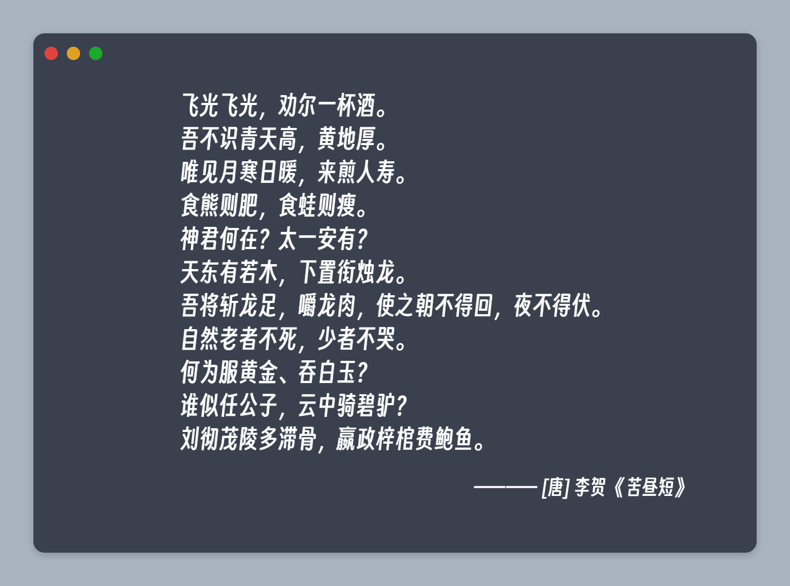

# Code Block Share | 代码模块分享

> - 项目依赖安装: npm install
> - 项目运行: npm start

目前仅支持输入`标题`、`作者`、`内容`，然后实时生成形如 mac 代码块的样式并支持导出

Q: 为什么做这个？

A: 微博长文超过字数限制被吞了，遂转为图片形式生成后用于发布（我贴张图总可以了吧）

## DONE

1. ~~文本代码块的生成（简单的react实现）~~
2. ~~支持导出功能生成图片（接入 dom-to-image）~~
3. ~~新增本地复制功能~~

## TODO

1. 接入 dark/light 切换（整理 scss 变量）
3. 增加对于 `代码分享` 等更多模块的支持，支持多种模板的选择和使用（接入 MDX）
4. 优化样式

## 项目当前效果

导出后效果图

